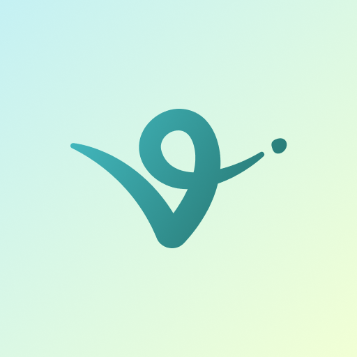
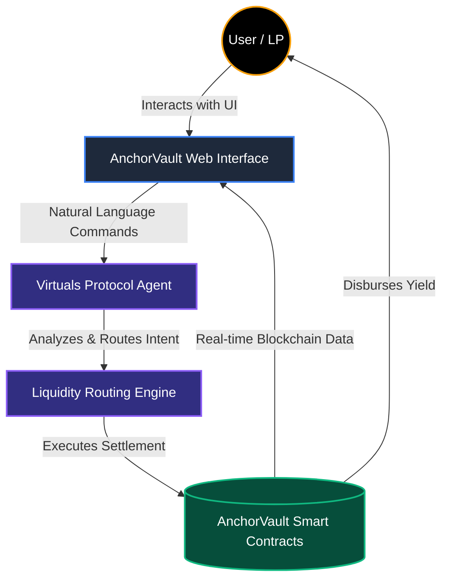

<div align="center">
  <br />
  
  
  
  <h1 align="center">🛡️ AnchorVault <span style="color: #646CFF;">x</span> Virtuals Protocol</h1>
  
  <p align="center">
    <strong>The Next-Generation Omnichain Remittance & AI Liquidity Routing Interface</strong>
  </p>

  <p align="center">
    <a href="https://react.dev/"></a>
    <a href="https://vitejs.dev/"></a>
    <a href="https://tailwindcss.com/"></a>
    <a href="https://www.typescriptlang.org/"></a>
    <a href="https://www.framer.com/motion/"></a>
  </p>
</div>

---

## 🌐 The Vision: A Paradigm Shift

Welcome to the **AnchorVault x Virtuals Protocol** frontend platform. AnchorVault represents a paradigm shift in how capital flows globally. 

By merging the predictability of stablecoin reserves with the decentralization and autonomous intelligence of the **Virtuals Protocol**, we are eliminating the friction, cost, and delays of cross-border settlements. This isn't just an upgrade; it's a completely new foundation for real-world assets and AI agents operating seamlessly on-chain.

<br />

## 🧠 System Architecture & Interaction Flow

The integration combines an intuitive React-based Web3 interface with the powerful autonomous backend agents of Virtuals Protocol, settling instantly via AnchorVault liquidity pools.



<br />

## ✨ Premium Frontend Features

We have built this platform focusing on a **High-Fidelity, Liquid-Glass Web3 Aesthetic**. Every interaction is designed to feel responsive, premium, and alive.

| Component | Description | Technologies Used |
| :--- | :--- | :--- |
| **Dynamic Landing Page** | A seamless modern UI highlighting the core vision, featuring immersive scroll-based reveals. | `React`, `Framer Motion` |
| **Bento Grid Architecture** | `<BentoGrid />`: A visually stunning, responsive card-based layout showcasing core platform benefits. | `Tailwind CSS`, `CSS Grid` |
| **Interactive Video Hub** | `<VideoHub />`: Engaging multimedia display for product demonstrations and architectural pitches. | `HTML5 Video`, `React Hooks` |
| **Data Visualizations** | Real-time mockups of pool performance, APY curves, and liquidity analytics. | `Recharts` |
| **Waitlist & Onboarding** | `<Waitlist />`: Capture early adopter interest directly on the site with celebration micro-interactions. | `canvas-confetti` |

<br />

## 🛠️ Technology Stack Breakdown

Our tech stack is strictly typed, highly optimized, and styled for modern Web3 demands.

*   **Core Framework:** React 19 + TypeScript (Strict Mode)
*   **Build Tooling:** Vite (Ultra-fast HMR and optimized production bundles)
*   **Styling Engine:** Tailwind CSS v4 featuring bespoke Glassmorphism utilities and fluid typography.
*   **Animation & Micro-interactions:** Framer Motion (page transitions, spring animations) and `canvas-confetti` for conversion events.
*   **Iconography:** Lucide React (feather-light SVG icons)
*   **Code Quality:** Oxlint (hyper-fast Rust-based linter for JS/TS)

<br />

## 💻 Developer Setup & Installation

Follow these steps to deploy and run the AnchorVault Virtuals interface locally.

### 1. Prerequisites
Ensure you have the following installed on your developer machine:
*   [Node.js (v18+)](https://nodejs.org/)
*   Git

### 2. Local Setup
Clone the repository and install the dependencies:
```bash
git clone https://github.com/Anchorvault/anchorvault-Virtuals.git
cd anchorvault-Virtuals
npm install
```

### 3. Running the Development Server
Launch the ultra-fast Vite dev server:
```bash
npm run dev
```
Open **`http://localhost:5173`** to interact with the live portal.

### 4. Building for Production
To compile the TypeScript and build optimized static assets:
```bash
npm run build
```

<br />

## 🤝 Contributing

We welcome contributions from the community to enhance the AnchorVault x Virtuals platform. 
1. **Fork** the repository
2. **Create** a feature branch (`git checkout -b feature/AmazingFeature`)
3. **Commit** your changes (`git commit -m 'Add some AmazingFeature'`)
4. **Push** to the branch (`git push origin feature/AmazingFeature`)
5. **Open a Pull Request**

<br />

## 📜 License

This project is licensed under the **MIT License**.

---
<div align="center">
  <sub>Built with precision for the future of DeFAI. <b>AnchorVault Protocol</b>.</sub>
</div>
